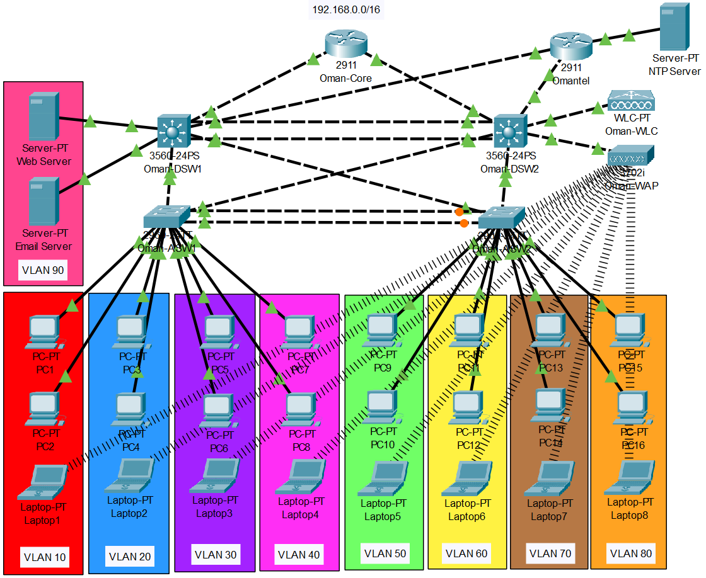

<p align="center">
  <span style="font-size: 2em; font-weight: bold;">Retard-proof Guide for Networking 2 project (hopefully)</span>
  <span style="font-size: 0.8em; margin-left: 10px;">im lookin at you hasan</span>
</p>

# Cisco Commands for Oman-site setup
> **Note:** Use these commands only as an example for other sites. Adjust IP addresses and VLANs accordingly.

<div align="center">
  
  
  
</div>
<br><br><br>
<div align="center">
  <p style="font-size: 0.8em; font-weight: bold">reference picture of my site</p>
  
  <br><br>
  <p style="font-size: 1em; font-weight: bold">Passwords used:</p>

  <div style="font-size: 1.1em;">


  | Type / Connection | Password |
  | :--- | :--- |
  | **Console Line** | `GUFGconsole2026` |
  | **VTY Lines** | `GUFGvty2026` |
  | **Enable Secret** | `GUFGenable2026` |
  | **VTP Domain** | `GUFGvtp2026` |

  </div>
</div>
<br>


### Basic Configuration 🌎
```cisco
en
conf t

! Banner Message
banner motd #
Gulf Unified Financial Group (GUFG) - Corporate Network
Unauthorized access is prohibited and will be monitored.
All activities are logged.
#

! dont forget to change the hostname
hostname Oman-Core

! also dont forget to change the domain name per-site
ip domain-name om.gufg.com

no ip domain-lookup
crypto key generate rsa
2048

ip ssh version 2

ip access-list standard SSH_IT_ONLY
permit 192.168.40.0 0.0.0.255
exit

! Console Line
line console 0
password GUFGconsole2026
login
exit

! VTY Lines - SSH Only (Telnet disabled)
line vty 0 15
password GUFGvty2026
login
transport input ssh
access-class SSH_IT_ONLY in
exit

! Enable Secret (Privileged mode)
enable secret GUFGenable2026
service password-encryption

do wr
```

### Vlan Configuration (Oman-site) 🎨
Paste this in both Layer 3 switches (DSW1 & DSW2)
```cisco
enable
configure terminal

! dont forget to change this per-site
vtp domain GUFG_OMAN

vtp password GUFGvtp2026

! add vtp mode client if neccesary

vlan 10
name MANAGEMENT
vlan 20
name ADMINISTRATION
vlan 30
name FINANCE
vlan 40
name IT
vlan 50
name HUMAN_RESOURCES
vlan 60
name INVESTMENT
vlan 70
name AUDIT
vlan 80
name CUSTOMER_SUPPORT
vlan 90
name SERVERS
vlan 99
name MGT
exit

do wr
```
Paste this in DSW1
```cisco
interface Vlan 10
ip address 192.168.10.252 255.255.255.0
ip helper-address 192.168.0.1
standby 10 ip 192.168.10.254
standby 10 priority 110
standby 10 preempt
exit

interface Vlan 20
ip address 192.168.20.252 255.255.255.0
ip helper-address 192.168.0.1
standby 20 ip 192.168.20.254
standby 20 priority 110
standby 20 preempt
exit

interface Vlan 30
ip address 192.168.30.252 255.255.255.0
ip helper-address 192.168.0.1
standby 30 ip 192.168.30.254
standby 30 priority 110
standby 30 preempt
exit

interface Vlan 40
ip address 192.168.40.252 255.255.255.0
ip helper-address 192.168.0.1
standby 40 ip 192.168.40.254
standby 40 priority 110
standby 40 preempt
exit

interface Vlan 50
ip address 192.168.50.252 255.255.255.0
ip helper-address 192.168.0.1
standby 50 ip 192.168.50.254
standby 50 preempt
exit

interface Vlan 60
ip address 192.168.60.252 255.255.255.0
ip helper-address 192.168.0.1
standby 60 ip 192.168.60.254
standby 60 preempt
exit

interface Vlan 70
ip address 192.168.70.252 255.255.255.0
ip helper-address 192.168.0.1
standby 70 ip 192.168.70.254
standby 70 preempt
exit

interface Vlan 80
ip address 192.168.80.252 255.255.255.0
ip helper-address 192.168.0.1
standby 80 ip 192.168.80.254
standby 80 preempt
exit

interface Vlan 90
ip address 192.168.90.252 255.255.255.0
ip helper-address 192.168.0.1
standby 90 ip 192.168.90.254
standby 90 priority 110
standby 90 preempt
exit

interface Vlan 99
ip address 192.168.99.252 255.255.255.0
ip helper-address 192.168.0.1
standby 99 ip 192.168.99.254
standby 99 priority 110
standby 99 preempt
exit

do wr
```
and Paste this in DSW2
```cisco
interface Vlan 10
ip address 192.168.10.253 255.255.255.0
ip helper-address 192.168.0.5
standby 10 ip 192.168.10.254
standby 10 preempt
exit

interface Vlan 20
ip address 192.168.20.253 255.255.255.0
ip helper-address 192.168.0.5
standby 20 ip 192.168.20.254
standby 20 preempt
exit

interface Vlan 30
ip address 192.168.30.253 255.255.255.0
ip helper-address 192.168.0.5
standby 30 ip 192.168.30.254
standby 30 preempt
exit

interface Vlan 40
ip address 192.168.40.253 255.255.255.0
ip helper-address 192.168.0.5
standby 40 ip 192.168.40.254
standby 40 preempt
exit

interface Vlan 50
ip address 192.168.50.253 255.255.255.0
ip helper-address 192.168.0.5
standby 50 ip 192.168.50.254
standby 50 priority 110
standby 50 preempt
exit

interface Vlan 60
ip address 192.168.60.253 255.255.255.0
ip helper-address 192.168.0.5
standby 60 ip 192.168.60.254
standby 60 priority 110
standby 60 preempt
exit

interface Vlan 70
ip address 192.168.70.253 255.255.255.0
ip helper-address 192.168.0.5
standby 70 ip 192.168.70.254
standby 70 priority 110
standby 70 preempt
exit

interface Vlan 80
ip address 192.168.80.253 255.255.255.0
ip helper-address 192.168.0.5
standby 80 ip 192.168.80.254
standby 80 priority 110
standby 80 preempt
exit

interface Vlan 90
ip address 192.168.90.253 255.255.255.0
ip helper-address 192.168.0.5
standby 90 ip 192.168.90.254
standby 90 preempt
exit

interface Vlan 99
ip address 192.168.99.253 255.255.255.0
ip helper-address 192.168.0.5
standby 99 ip 192.168.99.254
standby 99 preempt
exit

do wr
```

### Security and Redundancy Measures 🔐
Paste this in Core router (Oman-Core)
```cisco
en
conf t
ip dhcp excluded-address 192.168.10.1 192.168.10.10
ip dhcp excluded-address 192.168.10.252 192.168.10.254

ip dhcp excluded-address 192.168.20.1 192.168.20.10
ip dhcp excluded-address 192.168.20.252 192.168.20.254

ip dhcp excluded-address 192.168.30.1 192.168.30.10
ip dhcp excluded-address 192.168.30.252 192.168.30.254

ip dhcp excluded-address 192.168.40.1 192.168.40.10
ip dhcp excluded-address 192.168.40.252 192.168.40.254

ip dhcp excluded-address 192.168.50.1 192.168.50.10
ip dhcp excluded-address 192.168.50.252 192.168.50.254

ip dhcp excluded-address 192.168.60.1 192.168.60.10
ip dhcp excluded-address 192.168.60.252 192.168.60.254

ip dhcp excluded-address 192.168.70.1 192.168.70.10
ip dhcp excluded-address 192.168.70.252 192.168.70.254

ip dhcp excluded-address 192.168.80.1 192.168.80.10
ip dhcp excluded-address 192.168.80.252 192.168.80.254

ip dhcp excluded-address 192.168.90.1 192.168.90.10
ip dhcp excluded-address 192.168.90.252 192.168.90.254

ip dhcp excluded-address 192.168.99.1 192.168.99.10
ip dhcp excluded-address 192.168.99.252 192.168.99.254

ip dhcp pool VLAN10_POOL
network 192.168.10.0 255.255.255.0
default-router 192.168.10.254
dns-server 8.8.8.8
exit

ip dhcp pool VLAN20_POOL
network 192.168.20.0 255.255.255.0
default-router 192.168.20.254
dns-server 8.8.8.8
exit

ip dhcp pool VLAN30_POOL
network 192.168.30.0 255.255.255.0
default-router 192.168.30.254
dns-server 8.8.8.8
exit

ip dhcp pool VLAN40_POOL
network 192.168.40.0 255.255.255.0
default-router 192.168.40.254
dns-server 8.8.8.8
exit

ip dhcp pool VLAN50_POOL
network 192.168.50.0 255.255.255.0
default-router 192.168.50.254
dns-server 8.8.8.8
exit

ip dhcp pool VLAN60_POOL
network 192.168.60.0 255.255.255.0
default-router 192.168.60.254
dns-server 8.8.8.8
exit

ip dhcp pool VLAN70_POOL
network 192.168.70.0 255.255.255.0
default-router 192.168.70.254
dns-server 8.8.8.8
exit

ip dhcp pool VLAN80_POOL
network 192.168.80.0 255.255.255.0
default-router 192.168.80.254
dns-server 8.8.8.8
exit

ip dhcp pool VLAN90_POOL
network 192.168.90.0 255.255.255.0
default-router 192.168.90.254
dns-server 8.8.8.8

interface GigabitEthernet0/1
ip address 192.168.0.1 255.255.255.252
no shut
exit

interface GigabitEthernet0/2
ip address 192.168.0.5 255.255.255.252
no shut
exit

ip route 192.168.10.0 255.255.255.0 192.168.0.2 
ip route 192.168.10.0 255.255.255.0 192.168.0.6 10

ip route 192.168.20.0 255.255.255.0 192.168.0.2 
ip route 192.168.20.0 255.255.255.0 192.168.0.6 10

ip route 192.168.30.0 255.255.255.0 192.168.0.2 
ip route 192.168.30.0 255.255.255.0 192.168.0.6 10

ip route 192.168.40.0 255.255.255.0 192.168.0.2 
ip route 192.168.40.0 255.255.255.0 192.168.0.6 10

ip route 192.168.50.0 255.255.255.0 192.168.0.2 
ip route 192.168.50.0 255.255.255.0 192.168.0.6 10

ip route 192.168.60.0 255.255.255.0 192.168.0.2 
ip route 192.168.60.0 255.255.255.0 192.168.0.6 10

ip route 192.168.70.0 255.255.255.0 192.168.0.2 
ip route 192.168.70.0 255.255.255.0 192.168.0.6 10

ip route 192.168.80.0 255.255.255.0 192.168.0.2 
ip route 192.168.80.0 255.255.255.0 192.168.0.6 10

ip route 192.168.90.0 255.255.255.0 192.168.0.2 
ip route 192.168.90.0 255.255.255.0 192.168.0.6 10

ip route 192.168.99.0 255.255.255.0 192.168.0.2 
ip route 192.168.99.0 255.255.255.0 192.168.0.6 10

ip route 0.0.0.0 0.0.0.0 192.168.0.2 
ip route 0.0.0.0 0.0.0.0 192.168.0.6 10
```
Paste this in both Distribution layer switches (DSW1 & DSW2)
```cisco
en
conf t

ip routing
spanning-tree mode pvst

ip dhcp snooping
ip dhcp snooping vlan 1,10,20,30,40,50,60,70,80,90,99

interface range FastEthernet0/1 - 18
shutdown
exit

interface range FastEthernet0/21 - 22
ip dhcp snooping trust
switchport trunk encapsulation dot1q
switchport mode trunk
switchport trunk native vlan 99
channel-group 1 mode active
no shut
exit

interface range FastEthernet0/23 - 24
ip dhcp snooping trust
switchport trunk encapsulation dot1q
switchport mode trunk
switchport trunk native vlan 99
no shut
exit

interface Port-channel 1
switchport trunk encapsulation dot1q
switchport mode trunk
switchport trunk native vlan 99
no shut
exit

do wr
```
Paste this in DSW1
```cisco
en
conf t

spanning-tree vlan 10,20,30,40,90,99 root primary
spanning-tree vlan 50,60,70,80 root secondary

interface range FastEthernet0/19 - 20
switchport mode access
switchport access vlan 90
switchport port-security
switchport port-security maximum 2
switchport port-security violation shutdown
switchport port-security mac-address sticky
no shut
exit

interface range FastEthernet0/23 - 24
ip dhcp snooping trust
switchport trunk encapsulation dot1q
switchport mode trunk
switchport trunk native vlan 99
no shut
exit

interface GigabitEthernet0/1
no switchport
ip address 192.168.0.2 255.255.255.252
no shut
exit

interface GigabitEthernet0/2
no switchport
ip address 192.168.0.10 255.255.255.252
no shut
exit

ip route 0.0.0.0 0.0.0.0 192.168.0.9

do wr
```
Paste this in DSW2
```cisco
en
conf t

spanning-tree vlan 50,60,70,80 root primary
spanning-tree vlan 10,20,30,40,90,99 root secondary

interface range FastEthernet0/19 - 20
ip dhcp snooping trust
switchport trunk encapsulation dot1q
switchport mode trunk
switchport trunk native vlan 99
no shut
exit

interface range FastEthernet0/23 - 24
ip dhcp snooping trust
switchport trunk encapsulation dot1q
switchport mode trunk
switchport trunk native vlan 99
no shut
exit

interface GigabitEthernet0/1
no switchport
ip address 192.168.0.14 255.255.255.252
no shut
exit

interface GigabitEthernet0/2
no switchport
ip address 192.168.0.6 255.255.255.252
no shut
exit

ip route 0.0.0.0 0.0.0.0 192.168.0.13

do wr
```
Paste this in the Access layer switches (ASW1 & ASW2)
```cisco
en
conf t

ip dhcp snooping
ip dhcp snooping vlan 1,10,20,30,40,50,60,70,80,90,99

interface range FastEthernet0/1 - 20
ip dhcp snooping trust
switchport mode access
switchport port-security
switchport port-security maximum 2
switchport port-security violation shutdown
switchport port-security mac-address sticky
spanning-tree portfast
no shut
exit

interface range FastEthernet0/21 - 22
shutdown
exit

interface range FastEthernet0/23 - 24
ip dhcp snooping trust
switchport mode trunk
switchport trunk native vlan 99
no shut
exit

interface range gigabitEthernet0/1 - 2
ip dhcp snooping trust
switchport mode trunk
switchport trunk native vlan 99
channel-group 2 mode desirable
no shut
exit

interface port-channel 2
switchport mode trunk
switchport trunk native vlan 99
no shut
exit

do wr
```
Paste this in ASW1
```cisco
interface range FastEthernet0/1 - 5
switchport access vlan 10
no shut
exit

interface range FastEthernet0/6 - 10
switchport access vlan 20
no shut
exit

interface range FastEthernet0/11 - 15
switchport access vlan 30
no shut
exit

interface range FastEthernet0/16 - 20
switchport access vlan 40
no shut
exit

interface Vlan 99
ip address 192.168.99.3 255.255.255.0
exit

ip default-gateway 192.168.99.254

do wr
```
Paste this in ASW2
```cisco
interface range FastEthernet0/1 - 5
switchport access vlan 50
no shut
exit

interface range FastEthernet0/6 - 10
switchport access vlan 60
no shut
exit

interface range FastEthernet0/11 - 15
switchport access vlan 70
no shut
exit

interface range FastEthernet0/16 - 20
switchport access vlan 80
no shut
exit

interface Vlan 99
ip address 192.168.99.4 255.255.255.0
exit

ip default-gateway 192.168.99.254

do wr
```

### Internet Connectivity 🔌

Paste this in the Edge Router (Omantel)
```cisco
en
conf t

interface GigabitEthernet0/0
ip address 209.165.200.226 255.255.255.252
ip nat outside
no shut
exit

interface GigabitEthernet0/1
ip address 192.168.0.13 255.255.255.252
ip nat inside
no shut
exit

interface GigabitEthernet0/2
ip address 192.168.0.9 255.255.255.252
ip nat inside
no shut
exit

ip route 0.0.0.0 0.0.0.0 GigabitEthernet0/0 
ip route 192.168.0.0 255.255.0.0 192.168.0.14 10

! Oman Internal
ip route 192.168.0.0 255.255.0.0 192.168.0.10 

! Bahrain (10.0.0.0/16) - Send to Core
ip route 10.0.0.0 255.255.0.0 192.168.0.10

! KSA (172.16.0.0/12) - Send to Core
ip route 172.16.0.0 255.240.0.0 192.168.0.10

! Qatar (172.20.0.0/16) - Send to Core
ip route 172.20.0.0 255.255.0.0 192.168.0.10

! Static Nat For Web server and Email Server
ip nat inside source static 192.168.90.1 209.165.200.233
ip nat inside source static 192.168.90.2 209.165.200.234

ip access-list extended GUFG_NAT_LIST
deny ip 192.168.0.0 0.0.255.255 192.168.0.0 0.0.255.255
deny ip 192.168.0.0 0.0.255.255 10.0.0.0 0.0.255.255
deny ip 192.168.0.0 0.0.255.255 172.16.0.0 0.15.255.255
deny ip 192.168.0.0 0.0.255.255 172.20.0.0 0.0.255.255
permit ip 192.168.0.0 0.0.255.255 any
exit

ip nat pool GUFG_OMAN 209.165.200.235 209.165.200.238 netmask 255.255.255.248

ip nat inside source list GUFG_NAT_LIST interface GigabitEthernet0/0 overload

ip access-list extended INTERNET_INBOUND
deny icmp any host 192.168.90.1
deny icmp any host 192.168.90.2
permit tcp any host 192.168.90.1 eq www
permit tcp any host 192.168.90.2 eq smtp
deny ip any 192.168.0.0 0.0.255.255
permit ip any any
exit

interface GigabitEthernet0/0
ip access-group INTERNET_INBOUND in
exit
```
Paste this in DSW1 and DSW2
```cisco
en
conf t  

ip access-list extended DEPT_SECURITY_POLICY
permit ip 192.168.0.0 0.0.255.255 10.0.0.0 0.0.255.255
permit ip 192.168.0.0 0.0.255.255 172.16.0.0 0.15.255.255
permit ip 192.168.0.0 0.0.255.255 172.20.0.0 0.0.255.255
permit ip 192.168.0.0 0.0.255.255 192.168.0.0 0.0.255.255
permit ip 192.168.50.0 0.0.0.255 10.0.50.0 0.0.0.255
deny ip 192.168.30.0 0.0.0.255 any
deny ip 192.168.50.0 0.0.0.255 any
permit ip any any
exit

interface vlan 30
ip access-group DEPT_SECURITY_POLICY in
exit

interface vlan 50
ip access-group DEPT_SECURITY_POLICY in
exit

do wr
```

## **IGNORE THIS TABLE** (its outdated)


### **Oman-site Addressing Table**
|Device   |Interface         |VLAN / Description       |IP Address   |Subnet Mask    |Default Gateway|Notes       |
|---------|------------------|-------------------------|-------------|---------------|---------------|------------|
|Oman-Core|Serial0/0/0       |Primary WAN Link to Bahrain (CHAP)|192.168.100.1|255.255.255.252|192.168.100.2  |Primary Link|
|Oman-Core|Serial0/0/1       |Backup WAN Link to Bahrain (PAP)|192.168.100.5|255.255.255.252|192.168.100.6  |Backup Link |
|Oman-DSW1|VLAN 10           |Management (HSRP Active) |192.168.10.2 |255.255.255.0  |192.168.10.254 |HSRP Active |
|Oman-DSW1|VLAN 20           |Administration           |192.168.20.2 |255.255.255.0  |192.168.20.254 |-           |
|Oman-DSW1|VLAN 30           |Finance                  |192.168.30.2 |255.255.255.0  |192.168.30.254 |-           |
|Oman-DSW1|VLAN 40           |IT                       |192.168.40.2 |255.255.255.0  |192.168.40.254 |-           |
|Oman-DSW1|VLAN 50           |Human Resources          |192.168.50.2 |255.255.255.0  |192.168.50.254 |-           |
|Oman-DSW1|VLAN 60           |Investment               |192.168.60.2 |255.255.255.0  |192.168.60.254 |-           |
|Oman-DSW1|VLAN 70           |Audit                    |192.168.70.2 |255.255.255.0  |192.168.70.254 |-           |
|Oman-DSW1|VLAN 80           |Customer Support         |192.168.80.2 |255.255.255.0  |192.168.80.254 |-           |
|Oman-DSW2|VLAN 10           |Management (HSRP Standby)|192.168.10.3 |255.255.255.0  |192.168.10.254 |HSRP Standby|
|Oman-DSW2|VLAN 20           |Administration           |192.168.20.3 |255.255.255.0  |192.168.20.254 |-           |
|Oman-DSW2|VLAN 30           |Finance                  |192.168.30.3 |255.255.255.0  |192.168.30.254 |-           |
|Oman-DSW2|VLAN 40           |IT                       |192.168.40.3 |255.255.255.0  |192.168.40.254 |-           |
|Oman-DSW2|VLAN 50           |Human Resources          |192.168.50.3 |255.255.255.0  |192.168.50.254 |-           |
|Oman-DSW2|VLAN 60           |Investment               |192.168.60.3 |255.255.255.0  |192.168.60.254 |-           |
|Oman-DSW2|VLAN 70           |Audit                    |192.168.70.3 |255.255.255.0  |192.168.70.254 |-           |
|Oman-DSW2|VLAN 80           |Customer Support         |192.168.80.3 |255.255.255.0  |192.168.80.254 |-           |
|Oman-ASW1|-                 |Access Switch 1          |N/A          |N/A            |N/A            |Access Layer|
|Oman-ASW2|-                 |Access Switch 2          |N/A          |N/A            |N/A            |Access Layer|
|Oman-ASW3|-                 |Access Switch 3          |N/A          |N/A            |N/A            |Access Layer|
|Oman-ASW4|-                 |Access Switch 4          |N/A          |N/A            |N/A            |Access Layer|
